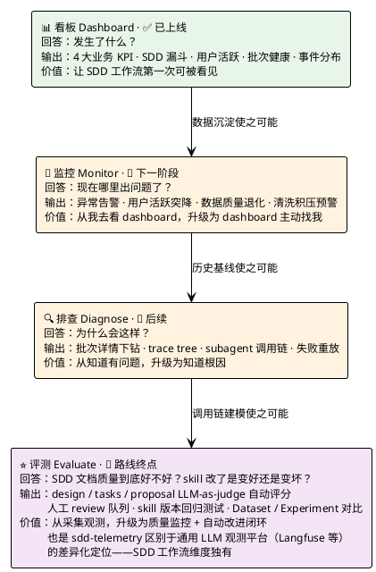
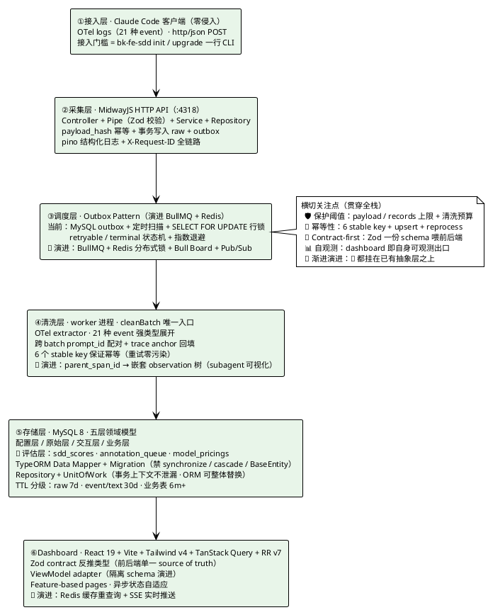

# SDD 观测平台 · 团队推广汇报

更新时间：2026-05-25
作者：limengdufe

## 一、为什么要做这件事

公司前端团队在试点 SDD（Spec-Driven Development，规格驱动开发，源自 openspec 方法论）工作流。核心理念是把"需求规格 / 系统设计 / 任务清单"作为可评审的一等工程产出前置，代码实现严格收敛到规格上，而不是边写边补、需求漂在脑子里。bk-fe-proposal / bk-fe-design / bk-fe-task / bk-fe-code 这套 Claude Code skill 是这个方法论在团队里的工具化落地。

但规格是不是真的有人写、design 是不是覆盖了关键决策、用户是不是真的按规格在走、skill 改了之后产出质量是变好还是变坏——这些问题之前只能靠抽样和感觉。

传统观测系统看的是"接口有没有返回 200"，对 AI 工作流这种"人 + AI + 流程"的新形态毫无用处。这块空白就是 sdd-telemetry 要补的位置。

## 二、当前到哪一步，下一步往哪走

平台规划了四个递进的能力，当前已上线第一个，后面三个的演进路径都是清晰可见、不需要架构重写的。



这个阶梯类比 Gartner 的 Observability Maturity 模型，或者 DataDog 把可观测性拆成 Logs → Metrics → Traces → APM 的演进路径。当前我们落在第一格（看板），但底座决定了上面三步都能往上长，不会卡在某一格就走不动了。

## 三、技术架构



整张图最关键的是 🚧 标记的位置——那些不是"还没做的功能"，是已经为下一步留好接口的演进位。比如调度层从 outbox 切到 BullMQ，业务代码一行不用改，因为 service 不依赖具体调度实现；评估层挂到第⑤层，因为 Repository + UnitOfWork 让新表能复用现有事务上下文。

## 四、三个我反复推敲过的判断

这套架构里有几个地方做过取舍，这里讲三个最关键的。

### 1. 先 outbox 跑通业务，再升级 BullMQ

Outbox + 定时扫描在工程上"够用但不优雅"。一开始就上 BullMQ + Redis 也技术可行，但意味着两件事一起做，风险翻倍。我选了先把"raw → 清洗 → 派生 → dashboard"这条主线跑通，把调度抽成一个明确的接口，BullMQ 改造只需要换掉这一层适配器。

这背后的判断是：先有 right thing，再有 right thing done right。工程升级和业务验证要拆开做。

### 2. ORM 不让它泛滥，Repository + UnitOfWork 隔离

TypeORM 用了，但禁掉了 cascade / synchronize / BaseEntity / lazy relation 这些"魔法功能"，所有表结构走 migration，service 层不直接看到 ORM API，一切走 Repository 接口。事务上下文用 UnitOfWork 显式传递，不依赖框架隐式注入。

代价是写代码多写几行，收益是：未来引入 Redis 缓存层、BullMQ、甚至直接把 MySQL 换成 ClickHouse（Langfuse 用的列存方案），业务代码都不用动。可演进性不是事后补的，是 day-one 的解耦决定的。

### 3. 系统性对标 Langfuse，找到差异化定位

LLM 可观测领域已经有开源标杆 Langfuse，一开始我就有"是不是该直接用 Langfuse"的疑问。花了两周把 Langfuse 的数据模型 / Trace 树 / Score / Dataset / Annotation queue 全部读了一遍，输出了两万五千字的对标分析（docs/proposal-langfuse-comparison.md）。

结论是：Langfuse 走 traces 通路，适合通用 LLM 应用；但 SDD 工作流维度（skill / work_item / artifact / SDD 漏斗）是业务字段，traces 给不了这种灵活性，必须走 logs 通路。同时我从对标里识别出当前实现的 10 个改进点，排成 P0 / P1 / P2 路线图，已经修完 P0 的 5 个（B1 到 B5）。

这不是"我做了个工具"，是"我在行业图谱里给自己定了位"。

## 五、现在能看到什么

平台跑起来之后，dashboard 已经把 SDD 工作流的几个关键维度立起来了：四个业务 KPI（活跃用户 / 技能调用次数 / 覆盖需求数 / 生成文档数）、SDD 漏斗（哪些 skill 用得多、哪些环节人会断掉）、用户维度（按人看技能调用分布和活跃度）、批次健康（parsed / processing / failed / duplicate 状态）、事件分布（21 种 OTel event 的命中比例）、数据质量（字段覆盖率 / 跨 batch 配对成功率）。

我自己机器上 dogfood 了几周，修了一批清洗层 bug（B1 到 B5），数据从"看着挺多"变成"敢拿数据下结论"。下午会现场拉一份真实 dashboard 给你看，比文字描述直观。

种子用户灰度的核心目标之一，就是产出"通过 dashboard 发现了 X，我们做了 Y"这样的具体案例，把"能力底座已就绪"转化成"可被引用的价值故事"。

## 六、推广节奏

接入门槛极低是这次推广的最大杠杆。用户不需要懂 OTel，不需要手动配环境变量，跑一行命令就完事：

```bash
bk-fe-sdd upgrade
```

这条命令是 bk-fe-sdd CLI 工具的一部分，init 和 upgrade 都会自动写入 OTel 配置，用户对底层无感知。

基于这个低门槛，推广节奏压到两周：

第一周，在 5 个核心同学的电脑上启用，主要目的是把数据通路验证一遍，把上报场景里的边角问题修掉，同时在 dashboard 上沉淀第一批可讲的案例。

第二周，在前端团队全员铺开（几十人，本质上也是灰度规模）。这一步的支撑是接入门槛低 + 第一周已经把潜在问题暴露过一轮。

为了让"什么时候推全员"不是拍脑袋，我给自己定了三类准入条件——不是要资源，是我自己的判断标尺，让推广这件事的可控性透明出来：

- 数据通路验证：5 个用户连续 7 天稳定上报，batch parsed 率高于 95%，worker 没有积压。
- 业务价值显现：dashboard 上能讲出至少一个"通过数据发现的具体问题"。
- 运维基线闭合：默认密码强化、MySQL 端口不对外、Docker 日志 rotate、磁盘容量巡检，都是一周内能做完的项目。

如果第二周这三类没全部达到，我会延后，或者缩限场景（比如只覆盖前端不跨域），不会强推。

## 七、已识别的风险与处理思路

部署在多人共用服务器上，基础 Docker 跑得起来，但生产级保障还有几块没补完。我做过一次完整核验，把风险分了两类。

一类是一周内能闭合的：默认密码 / MySQL 端口暴露 / Docker 日志膨胀 / 磁盘巡检 / 误删 volume 的流程防护。这些跟随推广节奏做掉。

另一类需要更长周期：自动备份 + 异地存档、监控告警平台对接、灰度回滚机制。这些放在全员推广后两周内补齐，期间靠手动回退兜底。

单独要标记一下 PII 风险：上报数据里包含用户的 prompt 原文和 Claude 响应原文，当前明文落库。短期内由于全是公司同事、数据不出公司，风险可控；但长期需要立项做对话脱敏、加密落库、访问审计。这一项不挡推广，但我希望它在你那里挂个号——哪天合规找过来时，我们是"早看到了、按节奏推进"，不是"出事了才发现"。

## 八、下一步

第一周内：写出一份接入指南（一段命令 + 五行环境变量说明 + dashboard 链接），让任何同学都能 5 分钟接入；同步推送给 5 个种子用户，跟进数据通路问题修复；完成运维 P0 闭合项。

第二周内：在前端团队全员推广，用接入指南直接发周会和群；启动监控能力开发（能力阶梯图第二阶段），给推广后的数据加一层主动告警；把"灰度首周发现的问题案例"整理成第二份汇报，供你后续给团队站会引用。
