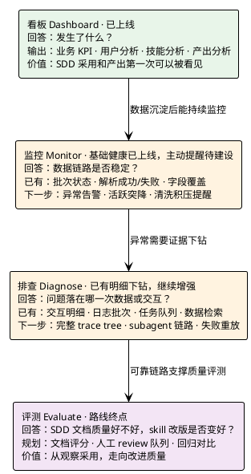
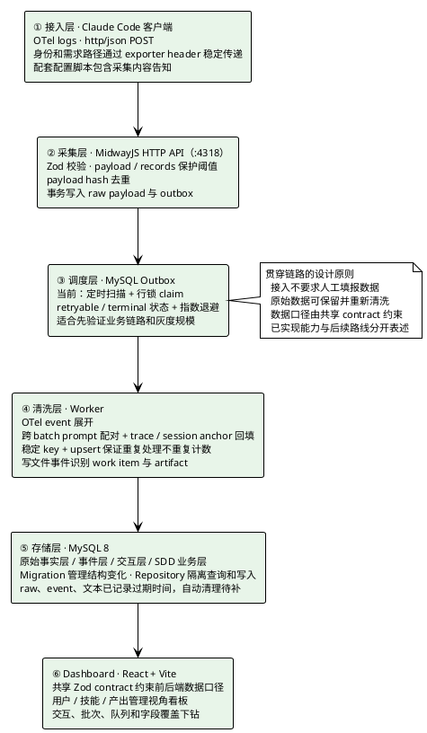
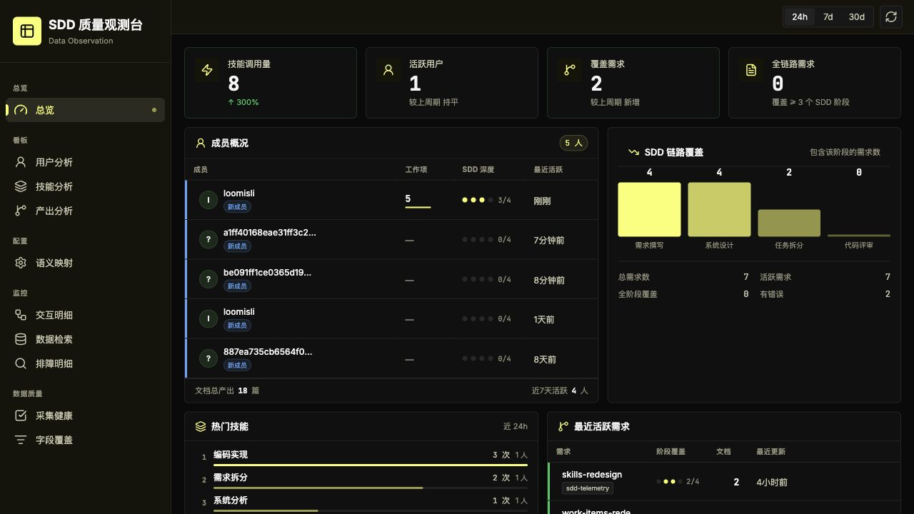
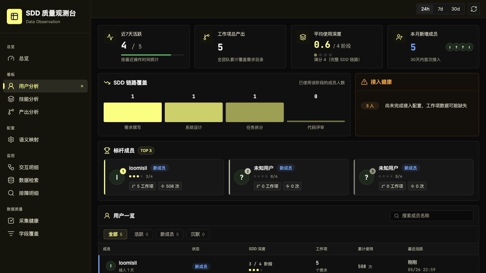
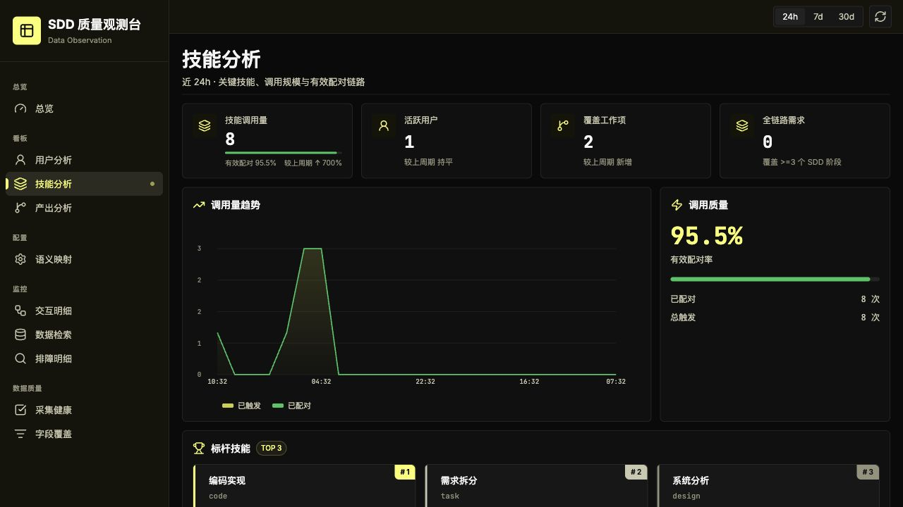
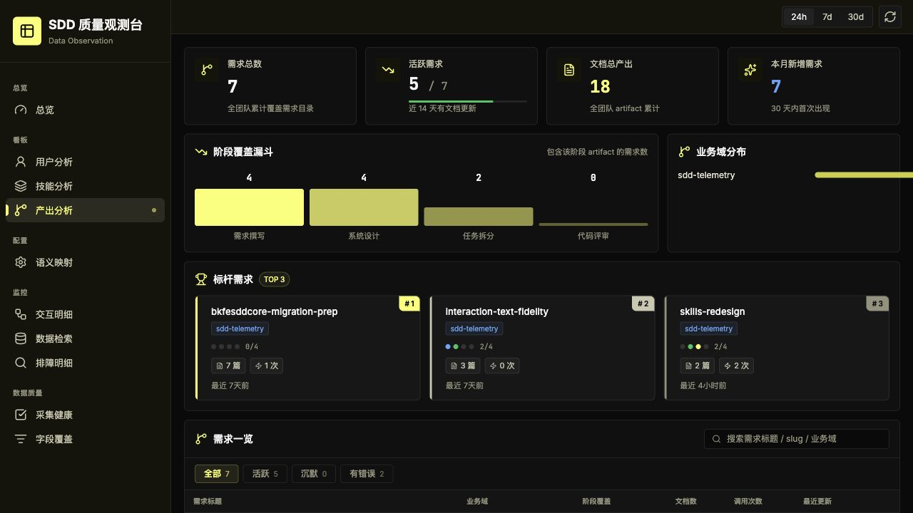
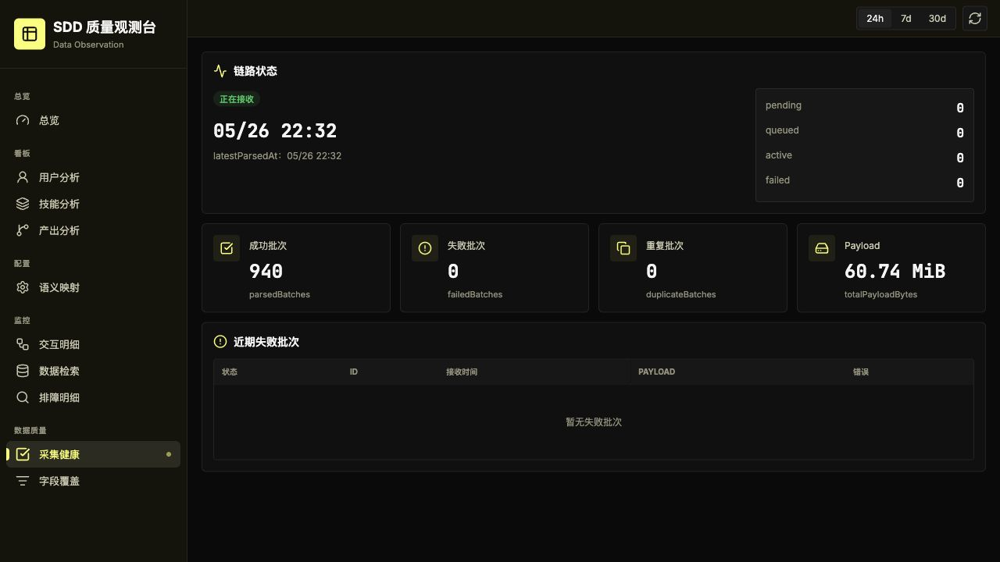

# SDD 观测平台 · 团队推广汇报

更新时间：2026-05-26
作者：limengdufe
核验说明：本文已按当前代码和本地真实 dashboard 页面保鲜；截图数据来自个人 dogfood，只用于展示能力，不作为团队推广结果。

## 一、为什么要做这件事

公司前端团队在试点 SDD（Spec-Driven Development，规格驱动开发，源自 openspec 方法论）工作流。核心理念是把“需求规格 / 系统设计 / 任务清单”作为可评审的一等工程产出前置，代码实现严格收敛到规格上，而不是边写边补、需求漂在脑子里。bk-fe-proposal / bk-fe-design / bk-fe-task / bk-fe-code 这套 Claude Code skill，是这个方法论在团队里的工具化落地。

但规格是不是真的有人写、design 是否覆盖了关键决策、用户是否按链路推进、skill 改版之后产出有没有变好，这些问题之前只能靠抽样和感觉。

传统观测系统能告诉我们接口是否成功、请求是否报错，却回答不了 AI 工作流里“人是否采用方法、流程是否落地产出”这类管理问题。sdd-telemetry 要补的是这一层：把实际使用、文档沉淀和链路健康变成可检查的证据。

## 二、当前到哪一步，下一步往哪走

平台规划了四个递进能力。目前看板已经上线，采集健康和基础排查入口也已经可以使用；主动告警、完整调用树和文档质量评测仍属于后续建设范围。



当前进度不是一张静态 dashboard 原型：业务看板、采集健康、排障下钻以及离线部署链路已经贯通。下一阶段的重点，是在真实灰度数据上建立告警基线，再判断质量评测值得投入到什么深度。

## 三、技术架构



这里最重要的不是技术名词，而是两件事。第一，原始上报与业务派生分开存，清洗规则调整后可以基于原始事实重算，不必向使用者重新采数据。第二，从入口身份、异步清洗到页面展示都保留了可检查证据，看到的数字能够继续往下追。

## 四、三个我反复推敲过的判断

这套架构里有几个地方做过取舍，这里讲三个最关键的。

### 1. 先 outbox 跑通业务，再考虑更重的队列设施

一开始就上 Redis 和独立消息队列并不难，但它解决的是并发和调度规模问题，不是 SDD 指标是否有价值的问题。当前使用 MySQL outbox、锁领取、失败重试和终止状态，已经足够支撑个人 dogfood 与小规模灰度，也让 raw 到派生数据的主链路先得到验证。

后面如果真实推广出现处理延迟、积压或多实例调度需求，再升级队列设施会更有依据。当前阶段先证明数据能支持判断，比提前堆运维组件更重要。

### 2. ORM 能用，但不能让数据口径藏在魔法里

服务端使用 TypeORM 和显式 UnitOfWork，结构变更通过 migration 管理；查询和写入落在 Repository 中。worker 的清洗路径同样把持久化访问收拢到 repository，而不是让配对、幂等、需求识别逻辑散落在各处。

这项取舍的收益很直接：一条指标被质疑时，可以沿着 contract、查询、派生写入和原始 payload 找回依据；清洗层修正后，也能有边界地重算业务数据。对于要拿去汇报和推广的数据，这比少写几行代码更重要。

### 3. 对标 Langfuse，但不把 SDD 做成通用 trace 看板

LLM 可观测领域已经有开源标杆 Langfuse，所以一开始就需要回答“为什么不直接用现成方案”。详细对标分析已经沉淀在 `docs/proposal-langfuse-comparison.md`。

结论是：通用 trace 方案擅长模型调用、成本和调用树；SDD 要识别的却是 skill 激活方式、需求目录、proposal / design / task 等文档写入，以及阶段是否走完整。Claude Code 的 logs 通路包含这些业务信号，因此当前继续走 logs，并在清洗层重建 SDD 关系，是贴合目标的选型。

这并不排斥后续平行接入通用 trace 工具。通用观测可用于看模型调用表现，sdd-telemetry 继续负责看方法是否真正形成工程产出，两者关注点不同。

## 五、现在能看到什么

最近一轮迭代已将总览、用户分析、技能分析、产出分析统一到面向管理者的展示视角，同时保留交互明细、排障明细、采集健康和字段覆盖作为证据下钻入口。

下面四张核心画面和一张链路健康补充画面，是 2026-05-26 从本地真实页面截取的 dogfood 数据。它们说明平台已经具备可演示能力，不代表团队推广效果；页面时间按北京时间展示。

### 总览：一屏看到采用、产出和阶段掉档



总览页适合作为现场演示第一屏：老板不需要先理解采集链路，就可以直接看到技能调用、活跃用户、覆盖需求、文档产出和 SDD 阶段覆盖。当前画面同时显示了接入身份噪声，这部分会在灰度前清理，不将其包装为推广成绩。

### 用户分析：谁在用，使用深度到哪一层



用户分析页能按成员观察使用深度、覆盖需求和活跃状态，并将未完成接入配置的成员单独提示出来。当前截图中的未知用户是历史接入口径问题的真实表现，说明平台已经能发现这类治理问题；对外报告应从口径清理后的灰度周期重新起算。

### 技能分析：先看采用规模，再看链路是否健康



当前页面可同时看到技能调用量、活跃用户、覆盖工作项、调用趋势和标杆技能。图中的“有效配对率”口径是采集与清洗链路健康，不是 design 或 task 内容质量评分；汇报时需要把这个边界讲清楚。

### 产出分析：从用了多少次，走到留下了什么



当前 dogfood 画面已经识别出 7 个需求目录、18 篇过程文档，并按 proposal、design、task、review 展示阶段覆盖。这个页面是 SDD 与普通工具调用统计的分界线：真正需要推广的不是按钮点击次数，而是能被评审和复用的工程产出。

### 采集健康：管理数字背后有持续运行的链路



截图时系统已有 940 个批次成功解析、失败批次为 0、累计处理 60.74 MiB payload。这说明本机真实流量下采集、异步清洗和页面查询链路持续可用；多人环境的稳定性仍应由灰度阶段验证。

## 六、推广节奏

接入门槛低是这次推广的重要杠杆。面向使用者的入口仍应保持为一行命令：

```bash
bk-fe-sdd upgrade
```

最近已经修正了 Claude Code 身份和需求路径上报方式：不再依赖容易受初始化时机影响的 resource 配置，而是通过稳定 header 传递。灰度包发出前，需要确认 `upgrade` 入口已经带上这一版配置和明确的数据采集告知。

基于这个低门槛，推广节奏仍按两周安排：

第一周，在 5 个核心同学的电脑上启用，主要验证身份归因、需求路径识别、清洗稳定性和敏感数据告知流程，同时沉淀第一批可讲的 dashboard 案例。

第二周，在第一周准入条件满足后，再向前端团队铺开。如果数据或运维基线没有闭合，则延后或缩小范围，不用覆盖人数掩盖数据质量问题。

全员推广前的三类准入条件保持不变，但口径更具体：

- 数据通路验证：5 个用户连续 7 天稳定上报，身份和需求目录归因正确，批次解析成功率高于 95%，worker 没有持续积压。
- 业务价值显现：dashboard 上能讲出至少一个“通过数据发现的问题，以及采取的改进动作”。
- 运维和合规基线闭合：强密码、MySQL 端口收口、日志轮转、磁盘巡检、访问范围和敏感数据告知均完成。

## 七、已识别的风险与处理思路

部署在多人共用服务器上，基础 Docker 运行和离线交付链路已经具备，但生产级保障仍有几块必须正视。

一类是灰度前应闭合的风险：生产 Compose 目前仍提供默认数据库密码并默认发布 MySQL 端口；采集控制器还留有用于排查 header 接入问题的临时诊断日志，可能记录身份和路径信息。这几项应在种子用户接入前完成强密码、端口收口和日志移除或脱敏。

另一类是灰度后继续补齐的保障：自动备份与异地存档、主动告警、自动清理过期数据、灰度回退流程。目前库表已经写入 raw、event 和交互文本的过期时间，但不能把“记录了过期时间”表述成“已经完成自动销毁”。

单独需要标记 PII 风险：当前接入会采集用户 prompt、工具参数和完整响应体，相关原文会入库。这里不能只用“内部使用”带过，需要在灰度接入前明确告知采集范围、限定访问人员，并为后续脱敏、访问审计和保存期限落实方案。

还有一个口径风险：页面中的“有效配对率”反映链路解析健康，不是文档质量分。design 是否完整、task 是否可执行，仍需要后续的人工 review 或自动评测能力回答。

## 八、下一步

第一周内：确认 `bk-fe-sdd upgrade` 携带最新接入配置与采集告知；完成服务器强密码、MySQL 端口收口和临时诊断日志处理；清理或冻结个人历史身份口径；将 5 位种子用户接入并跟进数据问题。

第二周内：基于首周真实数据形成一次复盘，内容包括链路稳定性、文档产出覆盖和至少一个可引用的改进案例；满足准入条件后再向前端团队推广，并启动主动告警能力建设。

本次现场展示建议按“总览 → 技能分析 → 产出分析 → 用户分析 → 采集健康”的顺序展开：先用总览给出一句话结论，再展开采用和产出价值，用用户页说明灰度治理意义，最后用健康页证明底层可靠性。交互明细页包含 prompt 和 response 原文，不建议直接截图或录屏流转；如需制作现场录屏或展示下钻能力，应提前清理身份噪声并准备脱敏样例。
