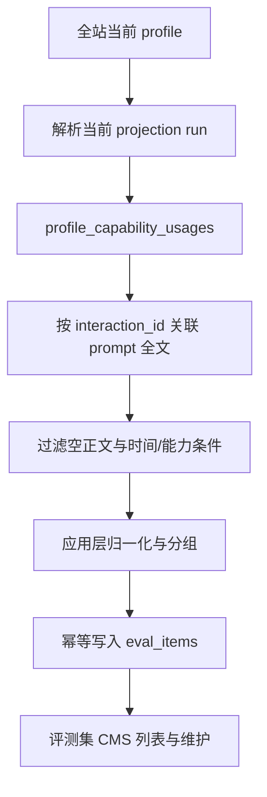

# Eval System Demo-First Implementation Plan

## Summary

先交付一条明天可演示的完整纵切片：`super_admin` 从当前 profile 的线上真实日志中导入 prompt，系统把它们长期快照为评测集，并在评测集 CMS 中完成查看、筛选、手工补充、编辑元数据、启停和删除。

这个切片只建设 `eval_items` 和评测集 CMS，不建设 run、bridge、runner 或 LLM judge。评测执行链在本切片稳定后，先通过本地 judge 校准 gate，再进入后续实施。

## Problem Frame

原计划先建设 run/bridge/runner 技术脊柱，却把用户明天需要展示的“真实 prompt 已经成为线上可管理评测集”推迟到了后续 Slice。它还错误假设可直接从没有 `profile_id` 的基础事实表导入，无法保证 SDD 与农小宝样本隔离。

当前仓库已经具备正确的数据入口：`profile_current_projection_runs` 标识每个 profile 的当前投影，`profile_capability_usages` 提供 profile 维度和能力归一结果，`sdd_interaction_texts` 提供尚未被保留任务清理的 prompt 全文。评测集必须从这条链路生成。

## Verified Data Baseline

2026-06-23 对本地开发库做了只读统计，没有输出 prompt 正文：

| Profile | 当前投影可关联交互 | 可导入去重 prompt | 备注 |
| --- | ---: | ---: | --- |
| `sdd-default` | 88 | 78 | 其中 `design` 全部可用正文 5 条，最近 30 天 2 条；演示默认不额外收窄时间 |
| `e2e-monorepo` | 1 | 1 | 对应“农小宝工作流” |
| `boss-a-monorepo` | 53 | 34 | 当前存在投影，但不在持久化 profile 配置列表中；不作为明日演示必选项 |

这只能证明开发库有数据。部署后必须在公司服务器数据库上重新执行导入并验证 `source=cleaned` 的数量大于 0；不能用 seed 或手工样本冒充线上真实样本。

## Requirements

### Real Prompt Import

- R1. 导入必须从指定 profile 的当前投影读取，不能跨 profile 扫描基础事实表。
- R2. 只有能关联到非空 `prompt_text` 的能力使用记录可以成为导入候选；保留期已清理的正文必须计入 skipped，而不是生成空样本。
- R3. 导入支持 profile、能力代码和可选时间范围；`from/to` 必须同时出现，出现时校验 `from < to` 且跨度不超过 31 天。UI 默认导入当前仍有正文的全部记录，明日演示默认导入 `sdd-default` 的 `design` prompt。
- R4. 导入必须幂等；同一 profile、目标能力、产物类型和归一化 prompt 重复导入时刷新来源统计，不新增重复行。
- R5. 导入结果返回扫描数、去重候选数、新增数、刷新数、manual→cleaned 升级数、空正文跳过数、超长正文跳过数、已删除样本跳过数和使用的 projection run ID，使“无观测”“正文已清理”“超限”“被主动排除”“全重复”和“新增成功”可区分；满足 `candidate = inserted + refreshed + upgraded + skippedDeleted`，且 `scanned = 接受的非空原始记录数 + skippedNoPrompt + skippedOversize`。

### Dataset CMS

- R6. 页面使用全站 Profile Switcher 的当前 `profileId`，切换 profile 后只显示该 profile 的评测集。
- R7. CMS 支持列表与详情、关键字/来源/能力/启用状态筛选、分页、手工新增、元数据编辑、启停和删除；列表只返回 prompt 摘要，完整 prompt 只通过单条详情读取。关键字只搜索 title、notes 和 target skill，不把 prompt 片段放进 GET URL 或访问日志。删除会清空正文并留下 key tombstone，防止下次日志导入把同一条重新加回。
- R8. `cleaned` 样本的 prompt、target skill 和 artifact type 不可直接编辑；页面提供“复制为手工样本”动作并预填内容，需要改写或重定向时另存为 `manual`，避免“真实 prompt/能力”来源失真。
- R9. `manual` 样本要求非空 target skill 和明确 artifact type，并允许编辑 prompt 与这两个目标字段；任何影响幂等 key 的字段变更后都重新计算 key，冲突时返回 409。
- R10. 列表必须分别展示来源 capability、观测到的 raw capability、规范 target skill、观测次数、首次/最后观测时间和来源 interaction，点击后可查看完整 prompt 与备注；不能把语义代码 `design` 伪装成可执行 skill 名。
- R11. 空集、导入结果为 0、profile 无当前投影、请求失败和权限不足均有明确状态，不能统一显示“暂无数据”。

### Security, Retention, and Compatibility

- R12. 所有 `/api/eval/*` CMS 端点仅允许 `super_admin`；viewer 返回 403，匿名用户返回 401。
- R13. `eval_items.prompt_text` 是管理员主动纳入评测集的长期快照，不随 `sdd_interaction_texts` 的 30 天清理删除；本切片不设自动 TTL，保留到管理员删除。UI 在导入确认处明确说明保留语义和潜在敏感内容。
- R14. 服务端日志、错误信息和导入统计不得记录 prompt 正文；CMS 把 prompt 视为不可信纯文本，不执行 HTML、Markdown 或链接协议。所有评测项响应设置 `Cache-Control: no-store`，避免完整正文或摘要被浏览器/代理缓存。
- R15. 本切片全为加法，不修改 ingest、worker 清洗或 profile projection 语义。
- R16. `sdd-default` 与 `e2e-monorepo` 的 profile manifest 开启 `evaluation`，`online-docs` 保持关闭。

### Demo Acceptance

- R17. 公司服务器页面能够从真实日志导入至少一条 `source=cleaned` 样本，并展示可核验的 profile、能力、interaction 来源和 prompt 全文。
- R18. 在当前开发库基线上，导入 `sdd-default + design` 应得到 5 个去重候选；重复执行不得增加总行数。
- R19. 演示者能够在 UI 中禁用一条 cleaned 样本、手工补一条样本；若环境存在第二个已启用且支持 evaluation 的 profile，则切换验证隔离。没有第二个可用 profile 时，隔离由双 profile 集成测试证明，不阻塞 SDD 线上演示。

## Scope Boundaries

### In Scope for Tomorrow Demo

- `eval_items` 持久化模型与迁移。
- profile-aware 的真实 prompt 导入。
- 评测集 CRUD API 与管理员 CMS 页面。
- profile/能力/来源/状态筛选和可核验来源信息。
- 自动化契约、鉴权、幂等和真实 MySQL 集成测试。
- 数据库/API/README/设计文档保鲜与部署后冒烟。

### Deferred to Follow-Up Work

- 本地 judge 校准 spike。
- `eval_runs`、`eval_run_items`、bridge token、claim/result 状态机。
- `tools/eval-runner`、本地 `claude -p` 判分和结果上报。
- rubric 在线版本化、run 页面、结果趋势和 run 对比。

### Outside V1

- 无头驱动 Claude Code。
- 自动 skill 版本 A/B。
- 知识召回、代码产物和 design 以外文档的正式 rubric。

## Key Technical Decisions

- KTD1. **当前 profile 投影是导入权威边界。** 通过 `profile_current_projection_runs` 解析当前 run，再读取同一 `profile_id + projection_run_id` 下的 `profile_capability_usages`；基础 `sdd_skill_usages` 只作为投影来源，不直接承担多 profile 隔离。
- KTD2. **CMS 独立于 judge gate 先交付。** 真实 prompt 的长期整理本身有价值，可以在不引入模型 token、runner 或 bridge 的情况下完成明日演示；判分基础设施仍需通过校准后才能建设。
- KTD3. **幂等 key 与来源解耦。** `item_key = sha256(JSON.stringify([profile_id, target_skill ?? "", target_artifact_type ?? "", normalized_prompt]))`；使用结构化序列化消除分隔符和 NULL 歧义，相同逻辑样本不会因 manual/cleaned 来源不同而重复。
- KTD4. **保留原文，判重不得破坏代码语义。** `normalized_prompt` 仅用于 hash，规则固定为 Unicode NFC、CRLF/CR 统一为 LF、首尾 trim；保留内部空格、缩进和换行，不把可能含代码/YAML 的不同 prompt 错误合并。数据库保存未归一化的原始 prompt 快照。
- KTD5. **cleaned 的来源语义不可原地改写。** CMS 对 cleaned 只允许修改 title、notes 和 enabled；修改 prompt、target skill 或 artifact type 必须复制为 manual 样本。
- KTD6. **profile 能力通过 manifest 暴露。** `evaluation=true` 表示该 profile 可以进入评测 CMS，不为本功能新增第二套 profile 白名单。
- KTD7. **删除使用无正文 tombstone。** 删除时清空 prompt、title、notes 和 origin 字段，设置 `deleted_at/deleted_by_user_id` 与 `enabled=false`，但保留 item_key/profile/target；默认列表排除 tombstone，后续导入命中时计入 skippedDeleted 而不复活。这样既移除长期正文，又避免误删样本被下一次 import 原样加回。
- KTD8. **来源能力与执行目标分离。** cleaned 样本原样保存 `origin_capability_code` 和 `origin_raw_capability_name`。`target_skill` 优先从当前 projection run 的 `profile_config_version_id` 对应配置解析，确保与生成该投影的规则一致；仅 legacy run 缺少版本时回退 serving config。解析方式是由 capability rule 的 `sourceRuleIds` 找到 skill source rule，并取第一个非空 `skillNames` 作为规范名；无法解析时为 NULL、默认 disabled，不把语义代码或 raw locator 猜成可执行 skill。产物类型仅显式映射 `design→design`、`proposal→proposal`、`task→tasks`。manual target skill trim 后不能为空，artifact type 必填。

## High-Level Technical Design

导入只读取当前投影，避免历史 projection run 重复。`eval_items` 是评测集的长期快照，不反向修改观测事实。

### Data Model: eval_items

| Field | Purpose |
| --- | --- |
| `id` | BIGINT 主键 |
| `item_key` | 逻辑样本幂等 key，唯一索引 |
| `profile_id` | profile 隔离与列表索引 |
| `source` | `cleaned` 或 `manual` |
| `origin_projection_run_id` | 本次 cleaned 来源的当前 projection run |
| `origin_interaction_id` | 可核验的一条来源 interaction |
| `origin_prompt_id` | 原始 prompt ID，可空 |
| `origin_capability_code` | profile 归一后的来源能力代码，如 `design` |
| `origin_raw_capability_name` | 观测到的原始 skill/locator 名称 |
| `target_skill` | 从 serving profile 的 skill source rule 解析出的规范可执行 skill；可空 |
| `target_artifact_type` | `design` / `proposal` / `tasks` / NULL |
| `prompt_text` | 原始 prompt 长期快照；仅 tombstone 可为 NULL |
| `title` / `notes` | CMS 人工信息 |
| `enabled` | 是否纳入后续 run |
| `occurrence_count` | 最近一次导入范围内归一化 prompt 的观测次数；manual 初始为 0 |
| `first_observed_at` / `last_observed_at` | 来源时间范围 |
| `last_imported_at` | 最近一次来源刷新时间 |
| `deleted_at` / `deleted_by_user_id` | 删除 tombstone 审计；删除时正文已清空 |
| `gmt_create` / `gmt_modified` | 审计时间 |

不在表中保存 response、产物正文或 judge 结果。

索引至少包含 `UNIQUE(item_key)`、`INDEX(profile_id, deleted_at, gmt_modified, id)`、`INDEX(profile_id, deleted_at, origin_capability_code, enabled)` 和 `INDEX(profile_id, deleted_at, target_skill)`；前者保证并发幂等，其余覆盖排除 tombstone 后的默认列表、来源能力和执行目标筛选路径。

### API Surface

| Method | Path | Behavior |
| --- | --- | --- |
| `GET` | `/api/eval/items` | 按 profile 分页列出摘要，支持 source/capabilityCode/targetSkill/enabled/keyword 筛选，并返回汇总计数 |
| `GET` | `/api/eval/items/:id` | 按 profile 读取单条详情和完整 prompt |
| `POST` | `/api/eval/items/import-from-logs` | 从当前 profile 投影导入并返回可证伪统计 |
| `POST` | `/api/eval/items` | 新建 manual 样本 |
| `PUT` | `/api/eval/items/:id` | 更新允许字段；cleaned 禁止改 prompt |
| `DELETE` | `/api/eval/items/:id` | 清空正文并写 tombstone；同 key 后续导入不复活 |

导入 body 包含 `profileId`、可选 `capabilityCode` 和成对出现的可选 `from/to`；UI 默认不附加时间条件，以最大化利用尚未清理的真实正文。响应包含 `scannedCount`、`candidateCount`、`insertedCount`、`refreshedCount`、`upgradedCount`、`skippedNoPromptCount`、`skippedOversizeCount`、`skippedDeletedCount` 和 `projectionRunId`。`candidateCount` 是可接受 prompt 归一化后的去重数；skippedDeleted 按去重 key 计数，其余 skipped 按原始能力使用记录计数。演示页面默认 `capabilityCode=design`，但 API 不硬编码单一能力。

列表、详情、更新和删除都要求显式 `profileId`；manual create 和 import 从 body 读取 profile。列表默认 `page=1&pageSize=20`、`pageSize<=100`，按 `gmt_modified DESC, id DESC` 稳定排序；`total` 表示当前筛选命中数，`summary` 表示该 profile 的全量 total/enabled/cleaned/manual。列表项只含最多 240 字符的 `promptPreview`，不含 `promptText`。所有 BIGINT ID 在 API 中使用十进制字符串；target skill 最长 191、title 500、notes 10,000、keyword 100、prompt 256,000 字符，导入遇到超长 prompt 时跳过单条而不让整批失败。

## Implementation Units

### U1. Eval Item Contract and Persistence

- **Goal:** 建立评测集唯一数据模型、共享 contract 和可验证 migration。
- **Requirements:** R2、R4、R6、R8、R9、R10、R13、R15。
- **Dependencies:** 无。
- **Files:**
  - Create `packages/api/src/contracts/eval.contract.ts`
  - Modify `packages/api/src/index.ts`
  - Create `packages/api/test/eval-contract.test.ts`
  - Create `server/src/infrastructure/mysql/migrations/1780000020000-create-eval-items.ts`
  - Create `server/src/infrastructure/mysql/entities/eval-item.entity.ts`
  - Modify `server/src/infrastructure/mysql/entities/index.ts`
  - Modify `server/src/infrastructure/mysql/data-source.ts`
  - Modify `server/src/infrastructure/mysql/verify-schema.ts`
- **Approach:** Contract 为列表摘要、单条详情、import 结果、manual create 和 update 分别建 schema；复用现有 `IdSchema` 表达 BIGINT 字符串，并落实 API Surface 中的字段上限。Update contract 校验字段形状，service 再依据数据库中已存在的 source 执行 cleaned/manual 字段权限，不能相信客户端上报 source。Migration 必须同时注册到显式 migration 列表，表、唯一索引和关键列加入 `db:verify` 白名单。
- **Patterns to follow:** `packages/api/src/contracts/profile-admin.contract.ts`、`server/src/infrastructure/mysql/migrations/1780000013000-create-profile-configs.ts`、`server/src/infrastructure/mysql/entities/index.ts`。
- **Test scenarios:**
  - 合法 cleaned/manual item 均通过 response schema。
  - 列表 schema 不允许 `promptText`，详情 schema 必须包含完整 `promptText`。
  - create manual 拒绝空 prompt、空 target skill、缺失/非法 artifact type 和超长 title/notes。
  - update schema 拒绝未知字段、空 prompt 和非法 target；service 对 cleaned 拒绝 prompt/target 字段，对 manual 允许这些字段。
  - `db:verify` 在缺表、缺唯一索引或缺关键列时失败。
- **Verification:** API package build 后 server 能消费新类型；migration 实际建表且 `db:verify` 报告包含 `eval_items`。

### U2. Profile-Aware Import and CMS API

- **Goal:** 提供幂等、可追溯的真实 prompt 导入与完整评测集 CRUD。
- **Requirements:** R1-R5、R7-R15、R17-R18。
- **Dependencies:** U1。
- **Files:**
  - Create `server/src/modules/eval/eval-item.repository.ts`
  - Create `server/src/modules/eval/eval-item.service.ts`
  - Create `server/src/modules/eval/eval-item.controller.ts`
  - Create `server/src/modules/eval/eval-item-domain.ts`
  - Modify `server/src/modules/profiles/profile-config.repository.ts`
  - Modify `server/src/modules/index.ts`
  - Modify `server/src/common/auth/auth.middleware.ts`
  - Modify `server/test/auth-middleware.test.ts`
  - Create `server/test/eval-item-domain.test.ts`
  - Modify `server/test/integration/api-contract.test.ts`
- **Approach:**
  - 所有操作先验证 profile 存在且 manifest 开启 evaluation；只有 import 需要解析当前 projection run，没有当前 run 时 import 返回明确的 409。list/detail/update/delete 继续服务已保存快照，不依赖来源投影仍然存在。
  - repository 只读取当前 run 的 `profile_capability_usages`，按 `interaction_id` **LEFT JOIN** `sdd_interaction_texts`，并按 capability/time 条件过滤；这样正文已清理或 interaction 为空的能力记录仍能进入 `skippedNoPromptCount`。查询按非空且单调的 capability usage `cu.id` 分批读取，不用可空 interaction ID 或静默截断的固定 LIMIT。
  - service 在应用层归一化、分组和计算观测统计，然后在事务中按 `item_key` upsert；每组按 `event_time DESC, cu.id DESC` 选择最新来源（event_time 为空时由 cu.id 决胜）和原始 prompt 快照。刷新 cleaned 来源时可用该规范等价的最新原文替换 prompt，但不覆盖人工 title、notes 和 enabled。
  - manual create 与 cleaned import 使用同一 key 规则；冲突响应返回现有 item ID。若 manual 样本后来被真实日志命中，使用真实日志原文替换 prompt、升级 provenance 为 cleaned、计入 `upgradedCount`，但保留 title、notes 和 enabled。
  - 为现有 `ProfileConfigRepository` 补充按 `profileId + versionId` 读取不可变配置快照的方法；cleaned import 复用它加载 projection run 所引用的版本，并按 KTD8 同时保存来源能力与解析目标。manual create/update 直接使用经过校验的目标字段。任何 key 字段变化都先重算 `item_key`，再依赖唯一索引处理并发冲突。
  - 所有读取和写入均强制 profile 过滤；controller 不接受从 URL item ID 跨 profile 修改。
- **Patterns to follow:** `server/src/modules/profiles/profile-config-admin.*` 的 controller/service/repository 分层、`TypeOrmUnitOfWork` 事务模式、`ApiHttpError` 的 400/404/409 语义。
- **Test scenarios:**
  - 当前 profile 有两条相同 prompt、不同 interaction 时，只插入一条 item，`occurrenceCount=2`。
  - 两个 profile 含相同 prompt 时生成两条隔离 item。
  - 重复导入返回 inserted=0、refreshed=1，总行数不变。
  - 空/纯空白 prompt 计入 skippedNoPrompt，不写表且不出现在日志。
  - 超过 256,000 字符的 prompt 计入 skippedOversize，其他候选继续导入，错误与日志不包含正文。
  - manual 样本被同一真实 prompt 命中时 source 升级为 cleaned、upgraded=1，人工元数据不丢失。
  - design/proposal/task 分别映射到预期 artifact type；来源 capability/raw 值都按原值保存。
  - SDD design 通过 profile config 解析到规范 skill（当前为 `bk-fe-design`）；source-backed locator 能力不被当成 skill。target skill 或 artifact type 无法解析的 cleaned item 默认 disabled。
  - 无当前 projection run 返回 409；未知/未开启 evaluation 的 profile 返回明确错误。
  - projection run 引用不存在的 config version 时返回 409，不静默回退到 serving；只有 version ID 本身为空的 legacy run 允许回退。
  - cleaned prompt 更新被拒绝；manual prompt 更新重算 key，冲突返回 409。
  - manual 修改 target skill 或 artifact type 会重算 key，冲突返回 409；cleaned 修改这些字段被拒绝。
  - viewer 对全部 CMS 端点得到 403，匿名用户得到 401。
  - list/detail/create/update/delete/import 响应均包含 `Cache-Control: no-store`，详情正文不进入服务端日志。
  - list/detail/update/delete 缺少或伪造 profileId 时失败，item ID 不能跨 profile 读取或修改。
  - 删除原始 `sdd_interaction_texts` 后，已导入 item 的 prompt 快照仍可读取。
  - 删除 item 后详情返回 404、正文和备注已从表中清空；重复 import 同一 key 返回 skippedDeleted=1 且不复活。
  - manual create 命中 tombstone 返回 409“该样本已删除”，不会绕过主动排除决定。
  - 两次并发导入同一范围不产生重复 item。
- **Verification:** 使用集成测试种子打通 projection → capability usage → interaction text → eval item；端点返回统一 API envelope 和完整 Zod contract。

### U3. Eval Dataset CMS Page

- **Goal:** 提供老板可直接看到并操作的真实 prompt 评测集页面。
- **Requirements:** R6-R11、R13-R14、R16-R19。
- **Dependencies:** U1、U2。
- **Files:**
  - Create `web/src/pages/admin/eval-items/EvalItemsPage.tsx`
  - Create `web/src/pages/admin/eval-items/useEvalItems.ts`
  - Create `web/src/pages/admin/eval-items/EvalItemEditor.tsx`
  - Create `web/src/pages/admin/eval-items/EvalImportDialog.tsx`
  - Create `web/src/pages/admin/eval-items/EvalItemsPage.test.tsx`
  - Modify `web/src/router.tsx`
  - Modify `web/src/components/layout/Sidebar.tsx`
  - Modify `web/src/pages/admin/profile-configs/ProfileConfigAdminPage.tsx`
  - Modify `packages/api/src/profile-config/profiles/sdd-default.ts`
  - Modify `packages/api/src/profile-config/profiles/e2e-monorepo.ts`
  - Modify relevant profile config tests
- **Approach:**
  - 新增 `super_admin` 路由 `/admin/eval/items` 和侧栏入口“评测管理”。页面直接消费 `useShellContext().profileId`，沿用顶栏 Profile Switcher。
  - 顶部展示 total/enabled/cleaned/manual 汇总；列表默认不加 capability 筛选，允许分别筛选来源能力、target skill、来源、状态和关键字。仅 `sdd-default` 的导入对话框默认选择 `capabilityCode=design`；切换 profile 时重置筛选，避免把 SDD 的 design 条件带到其他 profile。
  - 表格展示 prompt 摘要、来源 capability/raw 名、target skill、观测次数、最后观测和启用状态；选中行后单独请求详情，在编辑区以纯文本展示完整 prompt、来源 interaction 和备注，不经过 Markdown/HTML 渲染。详情 query 不持久化、`gcTime=0`，关闭详情或切换 profile 时立即清空选中项并移除详情缓存。
  - 导入对话框明确提示 prompt 将长期进入评测集，显示 profile、能力和可选时间范围；默认“全部仍可用正文”，成功后显示 scanned/candidate/inserted/refreshed/upgraded/skippedNoPrompt/skippedOversize/skippedDeleted 统计并刷新列表。
  - cleaned 样本编辑器锁定 prompt、target skill 和 artifact type，只开放 title、notes 和启停，并提供“复制为手工样本”预填动作；manual 样本允许修改这些 key 字段。
  - 删除使用明确的不可撤销确认，说明正文会被清空且相同 key 不再从日志重导；成功后清空详情并回到当前页，最后一页删除至空时回退一页。表格行和对话框支持键盘操作、可见焦点和语义标签；窄屏时列表与详情上下排列，不强塞双栏。
  - profile manifest 未开启 evaluation 时显示“不支持评测”状态，不发送导入请求。profile 开关来自 `/api/profiles` 的 serving config，不能只相信编译期常量。
  - 现有 Profile Config Admin 增加 evaluation 能力开关，发布时基于当前 config 只改 `manifest.evaluation`；source-backed profile 要等待 projection 完成并晋升 serving version 后，评测入口才开放。
- **Patterns to follow:** `web/src/pages/admin/profile-configs/ProfileConfigAdminPage.tsx`、`web/src/pages/admin/profile-configs/useProfileConfigAdmin.ts`、`web/src/components/ui/DataTable.tsx`、`web/src/api/client.ts`。
- **Test scenarios:**
  - 空列表显示“从真实日志导入”主行动，不显示模糊空态。
  - 导入成功后显示统计并刷新表格；导入 0 条时显示 profile/能力/时间范围无数据。
  - import 因无当前 projection 返回 409 时保留并继续显示已有评测项，只在导入区提示来源暂不可用。
  - 切换 ShellContext profile 后 query key 和列表随 profile 切换，不残留上个 profile 数据。
  - cleaned item 的 prompt 输入框不可编辑，manual item 可编辑。
  - “复制为手工样本”预填 prompt/target，但未修改任何 key 字段直接保存时以 409 提示已存在，不静默覆盖 cleaned 样本。
  - 含 `<script>`、`javascript:` 或 Markdown 链接的合成 prompt 仅按纯文本显示，不创建可执行 DOM 或可点击危险链接。
  - disable/delete/manual create 成功后列表和汇总同步刷新。
  - 删除需要确认；删除分页最后一条后页码回退，键盘可完成打开详情、导入、保存和关闭对话框。
  - API 失败展示可重试错误；按钮在请求期间禁用，避免重复提交。
  - `/api/profiles` 返回的 serving manifest 决定页面 gate；数据库仍是旧版本时不会误显示可导入。
  - Profile Config Admin 翻转 evaluation 后，提交 payload 除 `manifest.evaluation` 外与载入的 serving config 一致。
- **Verification:** super_admin 能完整走通导入、查看全文、禁用、手补和删除；非管理员无法进入路由。

### U4. Integration, Documentation, Deployment, and Demo Gate

- **Goal:** 证明功能在真实部署链路可用，并把新 contract、表和演示方法写入权威文档。
- **Requirements:** R12-R19。
- **Dependencies:** U1-U3。
- **Files:**
  - Modify `docs/api-contract.md`
  - Modify `docs/database-model.md`
  - Modify `README.md`
  - Modify `docs/design-eval-system.md`
  - Review `CLAUDE.md` and `AGENTS.md`; modify only if their stated workflow changes
- **Approach:**
  - API 文档记录 6 个 CMS 端点、鉴权、分页、list/detail 正文边界、import 统计和 cleaned prompt 不可编辑规则。
  - 数据库文档记录 `eval_items`、幂等 key、tombstone 删除、长期保留与来源表的 30 天保留差异。
  - README 增加评测集 CMS 入口、导入说明和“真实 prompt 长期快照”的权限提示。
  - 设计稿把最小路径改为 Demo CMS → judge 校准 gate → 执行脊柱 → rubric/结果，并纠正 profile-aware 导入来源。
  - 沿用现有 `compose.prod.yml` migrate/seed service、profile config 发布 API 和 `deploy/deploy-docker.sh`，本切片不新增持久环境变量。生产默认保持 `RUN_SEED=0`，部署后通过 Profile Config Admin 基于当前 serving config 只开启 evaluation 并发布，避免整份 seed 覆盖线上定制；只有确认 serving 仍是未改动内置版本时才可用 `RUN_SEED=1` 自动同步。
- **Test scenarios:**
  - API integration 测试覆盖 import、重复 import、CRUD、权限和快照保留。
  - 根级 typecheck/build 覆盖 packages/api、server 和 web。
  - migration/seed/verify/worker once/ingest health 的仓库标准运行链路全部通过。
  - `pnpm db:seed` 后 `/api/profiles` 中 `sdd-default` 与 `e2e-monorepo` 的 serving manifest 为 `evaluation=true`，`online-docs` 仍为 false。
  - 用一份已定制的 serving profile fixture 验证发布分支只改变 manifest.evaluation，其他配置字段和定义保持不变。
  - 浏览器以测试管理员账号验证：`sdd-default + design` 导入后出现 cleaned 样本；重复导入不增长；存在第二个可用 evaluation profile 时再验证 UI 切换隔离。
  - 部署后在公司服务器实际导入，确认 cleaned 数量大于 0，且每条有 origin interaction；seed/manual 数据不计入此验收。
  - 若线上 `candidateCount=0`，用已配置 OTel 的真实 Claude Code 客户端完成一次正常的 SDD design 调用，等待 ingest、worker 和 profile projection 更新后重试；禁止直接插表、复制本地库或用 seed/manual 冒充真实日志。
- **Verification:** R17-R19 全部在浏览器和 API 证据中成立，文档与代码口径一致，工作树不包含敏感 prompt 导出物或凭据。

## Acceptance Examples

### AE1. Import Real Design Prompts

- **Given:** 当前 profile 为 `sdd-default`，当前 projection run 可关联 5 个去重 design prompt。
- **When:** super_admin 选择 `design` 并执行从日志导入。
- **Then:** CMS 显示 5 个 `source=cleaned` 候选对应的评测项，每条保留 profile、能力和来源 interaction；实际 inserted 数受已有数据影响，但 candidateCount 为 5。
- **Covers:** R1-R5、R17-R18。

### AE2. Repeat Import Is Idempotent

- **Given:** 同一范围已经导入完成。
- **When:** super_admin 再次执行相同导入。
- **Then:** inserted 为 0，refreshed 大于 0，总行数不变，人工 title/notes/enabled 不被覆盖。
- **Covers:** R4-R5。

### AE3. Snapshot Survives Source Retention

- **Given:** 一条真实 prompt 已进入 `eval_items`。
- **When:** 对应 `sdd_interaction_texts` 后续按保留策略被删除。
- **Then:** CMS 仍能显示 eval item 的完整 prompt 和 provenance ID，来源详情可标记为已过期但样本不丢失。
- **Covers:** R2、R13。

### AE4. Profile Isolation

- **Given:** 两个已启用 evaluation profile 都存在评测项（本地测试使用 SDD 和农小宝）。
- **When:** 用户通过顶栏切换 profile。
- **Then:** 页面只显示当前 profile 的评测项和汇总，不能通过 item ID 修改另一 profile 的数据。
- **Covers:** R6、R12、R16、R19。

### AE5. Cleaned Prompt Fidelity

- **Given:** 一条 `source=cleaned` 样本已经导入。
- **When:** 用户编辑该样本。
- **Then:** prompt、target skill 和 artifact type 只读；用户可以修改 title/notes/enabled，或创建一条 manual 变体。
- **Covers:** R8-R9。

## Risks and Mitigations

| Risk | Mitigation |
| --- | --- |
| 公司服务器可用 prompt 已被 30 天保留策略清理 | 部署后立即导入；若 candidate=0，通过真实 SDD design 调用产生一条正常遥测，等待 worker/projection 更新后再导入；`eval_items` 快照随后长期保留 |
| 使用历史 projection run 导致重复或过时归因 | 只读取 `profile_current_projection_runs.current_projection_run_id` |
| 导入操作长期固化敏感 prompt | 仅 super_admin、导入前提示、支持删除、服务端日志禁止记录正文 |
| 同一 prompt 多 interaction 或并发导入产生重复 | 稳定归一化规则、唯一 item_key、事务内 upsert、并发集成测试 |
| profile 来源能力或规范 skill 无法解析 | 保留 capability/raw provenance；target skill 只从 skill source rule 解析，无法解析则 disabled 并在 UI 明确显示，不做名称猜测 |
| `RUN_SEED=1` 覆盖线上定制 profile | 生产默认保持 `RUN_SEED=0`，通过新增的 evaluation 开关发布当前 config 的单字段差异；只有确认未定制时才 seed |
| 演示环境与本地数据不同 | 部署后以 API import 统计作 gate，不使用本地计数替代线上验证 |

## Follow-Up Entry Criteria

后续执行链计划只有在本切片完成且 judge 校准通过后才能开始，并必须吸收已确认的审查结论：

- judge 使用固定模型、stdin 输入、结构化 schema、无工具/无会话持久化模式，并对 JSON 失败重试一次。
- 任何错误上报都必须清洗和限长，不能把文档正文、绝对路径或命令参数上传。
- bridge token 必须进入 `compose.prod.yml`、部署脚本和生产启动校验。
- bridge 只对精确 `/api/eval/bridge/*` 路径绕过浏览器 session，并在该边界强制 token；CMS `/api/eval/*` 仍保持 super_admin session 鉴权。
- result 必须校验 `executing + claimed_by + claim_version`，支持同版本同 payload 幂等重试，旧认领和晚到失败不能覆盖 scored。
- run 必须快照 target skill、skill version、执行模型和 judge model；零 item run 被拒绝。
- claimed lease 必须可回收或 requeue，不能只写 `claimed_until` 而不消费。
- `tools/eval-runner` 必须进入 pnpm workspace，使用仓库 Node >=22，并被根级 build/typecheck 覆盖。
- Slice 2 必须包含极简 run 页面；不能再用 curl 代替“线上看进度/分数”的产品验收。

## Documentation and Operational Notes

- 计划实施过程中不得把真实 prompt 样本写入测试 fixture、日志、截图或 commit message；集成测试使用合成 prompt。
- 浏览器验证默认使用本地测试账号 `test`，密码只能由用户在会话中提供或从本地安全凭据读取。
- 提交前执行仓库规定的旧目录扫描、`pnpm typecheck`、`pnpm build` 和运行链路冒烟。
- 本计划不新增环境变量、Docker 服务或独立部署物。
- 本次生产发布默认保持 `RUN_SEED=0`，部署后在 Profile Config Admin 打开 evaluation 并发布当前配置；仅确认未定制时才允许 `RUN_SEED=1`。无论哪条路径，都要等待 serving version 生效并核对 `/api/profiles`，否则评测入口会被旧配置正确地隐藏。
